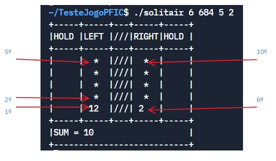

In solving this project, the C Programming Language must be used. In addition to the correct implementation of the requirements, take into account the following aspects:

The code presented must be well indented .
The code should compile without errors or warnings using gcc with the following flags:-Wall -Wextra -Wpedantic -ansi
To compile the code using the <math.h> library it is necessary to use the linking flag-lm
Pay attention to the given names of the variables, so that they are indicators of what they will contain.
Avoid using magic constants.
Avoid code duplication.
Consider implementing functions to improve readability, avoid duplication, and create more generic solutions.
The use of global variables is prohibited - ie variables declared outside any function.
When the program should always finish returning the value 0. You can do it through a return 0in the function main()or through the invocation of the function exit(0). If it returns with a non-zero value, it will automatically fail the tests on the Pandora platform.
To carry out this project, students must acquire the following skills:

file manipulation
vectors and matrices
strings
cycles
Conditions
main arguments
structures
Dynamic Memory
git
1.2 Description
This project consists of developing the game Solitair 0-21 in C language. The game consists of being able to turn over all the cards that are on the table, however the sum must always be between 0 and 21. The game has the following board:
```
+-----+-----+---+-----+-----+
|HOLD |LEFT |///|RIGHT|HOLD |
+-----+-----+---+-----+-----+
|     |  *  |///|  *  |     |
|     |  *  |///|  *  |     |
|     |  *  |///|  *  |     |
|     |  *  |///|  *  |     |
|     |  *  |///|  *  |     |
|     |  *  |///|  *  |     |
|     |  *  |///|  *  |     |
|     |  *  |///|  *  |     |
|     |  *  |///|  *  |     |
|     |  *  |///|  *  |     |
|     |  *  |///|  *  |     |
|     | 2   |///| -1  |     |
+-----+-----+---+-----+-----+
|SUM = 10                   |
+---------------------------+
>
```
The LEFT and RIGHT columns contain the face down cards, except the last two which are face up. Cards are just numbers that can be positive, negative or zero. The sum value is 10 at the beginning of the game. In each turn, the player chooses the card from the LEFT column or from the right COLUMN. The card is removed and the card's value is added to the SUM value. If the SUM is less than zero or greater than 21, the game is over and the player loses. The player wins getting to remove all the cards. In the example shown above, if the player selects the LEFT column, SUM will have the value 12. The card with the value '2' is removed and a new card will be revealed in the LEFT column:
```
+-----+-----+---+-----+-----+
|HOLD |LEFT |///|RIGHT|HOLD |
+-----+-----+---+-----+-----+
|     |  *  |///|  *  |     |
|     |  *  |///|  *  |     |
|     |  *  |///|  *  |     |
|     |  *  |///|  *  |     |
|     |  *  |///|  *  |     |
|     |  *  |///|  *  |     |
|     |  *  |///|  *  |     |
|     |  *  |///|  *  |     |
|     |  *  |///|  *  |     |
|     |  *  |///|  *  |     |
|     | 1   |///|  *  |     |
|     |     |///| -1  |     |
+-----+-----+---+-----+-----+
|SUM = 12                   |
+---------------------------+
>
```

It is possible to place some cards in reserve in the HOLD columns. For example in the following situation:
```
+-----+-----+---+-----+-----+
|HOLD |LEFT |///|RIGHT|HOLD |
+-----+-----+---+-----+-----+
|     |  *  |///|  *  |     |
|     |  *  |///|  *  |     |
|     |  *  |///|  *  |     |
|     |  *  |///|  *  |     |
|     |  *  |///|  *  |     |
|     |  5  |///|  *  |     |
|     |     |///|  *  |     |
|     |     |///|  8  |     |
|     |     |///|     |     |
|     |     |///|     |     |
|     |     |///|     |     |
|     |     |///|     |     |
+-----+-----+---+-----+-----+
|SUM = 19                   |
+---------------------------+
>q
```
the player cannot choose either the LEFT column or the RIGHT column, otherwise he loses the game. Alternatively, you can transfer the letter from the LEFT column to the HOLD column (left) or the letter from the RIGHT column to the HOLD column (right). In the following example the player has chosen to place the card in the LEFT column on HOLD.
```
+-----+-----+---+-----+-----+
|HOLD |LEFT |///|RIGHT|HOLD |
+-----+-----+---+-----+-----+
|  5  |  *  |///|  *  |     |
|     |  *  |///|  *  |     |
|     |  *  |///|  *  |     |
|     |  *  |///|  *  |     |
|     |  2  |///|  *  |     |
|     |     |///|  *  |     |
|     |     |///|  *  |     |
|     |     |///|  8  |     |
|     |     |///|     |     |
|     |     |///|     |     |
|     |     |///|     |     |
|     |     |///|     |     |
+-----+-----+---+-----+-----+
|SUM = 19                   |
+---------------------------+
>
```
However, the letter that was revealed still cannot be withdrawn. If the player puts the card in the LEFT column back to HOLD, the following situation will result:
```
+-----+-----+---+-----+-----+
|HOLD |LEFT |///|RIGHT|HOLD |
+-----+-----+---+-----+-----+
|  5  |  *  |///|  *  |     |
|  2  |  *  |///|  *  |     |
|     |  *  |///|  *  |     |
|     | -10 |///|  *  |     |
|     |     |///|  *  |     |
|     |     |///|  *  |     |
|     |     |///|  *  |     |
|     |     |///|  8  |     |
|     |     |///|     |     |
|     |     |///|     |     |
|     |     |///|     |     |
|     |     |///|     |     |
+-----+-----+---+-----+-----+
|SUM = 19                   |
+---------------------------+
>
```
Now the player can remove the card from the LEFT column and can also remove the cards from the HOLD column. These will be removed in the order in which they appear in the column (first the card with the number '2' and then the card with the column '5').

## 2 Implementation

In this repository there is a .c file with some necessary functions and the main function. The file should serve as a basis for the development of this project. The program can receive up to 4 command line arguments (main arguments), as follows:
```
./solitair <level> <seed> <n rows> <n holds>
```
Where

integer value for game seed - default value: 7
is the game's difficulty level - default value: 3
is the number of game lines - default value: 12
is the number of rows available in each column HOLD - default value: 2 If the arguments are not passed by the user, the default values ​​must be used. In other words, the user can pass only the seed, the seed and the level, the seed the level and the nrows or all the parameters.
The difficulty level relates to the standard deviation of the generated numbers. This is controlled by the function provided randn(). This function accepts two parameters: the mean (which must be 0) and the standard deviation which must be the level passed by the command line.

After starting the program and checking the main arguments, it is necessary to generate the letters that will fill the columns. First the cards in the LEFT column must be generated and then the cards in the right column. Each card must be generated by invoking the provided function randn_sat(). It is necessary to respect the order in which the cards are generated to pass Pandora's tests .

The vectors/or matrices used must be allocated in the dynamic memory area. This allocation should be done after reading the number of columns provided by the user when running the program.

If the player wins the game, the message should be displayed MSG_WIN, and then the program should terminate. If you lose, the message should be displayed MSG_LOSEand then the program should end.

### 2.1 Controls
  -    The keys 'a' and 's' are used to select the LEFT and RIGHT column charts, respectively.
  -   The keys 'q' and 'w' are used to HOLD cards in the left and right columns, respectively.
  -   The keys 'z' and 'x' are used to remove cards from the left and right HOLD columns, respectively.
  -   The key 'e' causes the program to terminate.

### 2.2 Implementation details
  - Pay attention to the '>' character which indicates that the program is waiting for user input.
  - The numbers appearing in the hold, left and right columns can be printed using: printf(" %-3d ", ...);
 
 
### 2.3 Generating random numbers
The generation of random numbers must be done by invoking the function randn_sat(), this function receives 4 parameters:

mean - mean value of distribution - must always be 0
std - standard deviation of the distribution - must be equal to the chosen level (variable level)
min - minimum value that can be generated - must always be -21
max - maximum possible value to be generated - must always be 21
So that the results can be compared, the generation of random numbers has to be done when the program starts and in the specified order: first the numbers of the LEFT column are generated and then the numbers of the RIGHT column. It is also necessary to take into account the order in which the numbers are presented in the respective columns. The following figure shows the order in which the numbers are generated, that is, the number marked 1 is the first number to be generated (result of the function call randn_sat()), the 2 is the second number to be generated... etc. The numbers are all generated using two loops (one for the LEFT column and one for the RIGHT column).



  
## 3 Examples of use
Here are some examples of games:
```
./solitair 6 684 5 2
+-----+-----+---+-----+-----+
|HOLD |LEFT |///|RIGHT|HOLD |
+-----+-----+---+-----+-----+
|     |  *  |///|  *  |     |
|     |  *  |///|  *  |     |
|     |  *  |///|  *  |     |
|     |  *  |///|  *  |     |
|     | 12  |///| 2   |     |
+-----+-----+---+-----+-----+
|SUM = 10                   |
+---------------------------+
>q
+-----+-----+---+-----+-----+
|HOLD |LEFT |///|RIGHT|HOLD |
+-----+-----+---+-----+-----+
| 12  |  *  |///|  *  |     |
|     |  *  |///|  *  |     |
|     |  *  |///|  *  |     |
|     | 6   |///|  *  |     |
|     |     |///| 2   |     |
+-----+-----+---+-----+-----+
|SUM = 10                   |
+---------------------------+
>a
+-----+-----+---+-----+-----+
|HOLD |LEFT |///|RIGHT|HOLD |
+-----+-----+---+-----+-----+
| 12  |  *  |///|  *  |     |
|     |  *  |///|  *  |     |
|     | -8  |///|  *  |     |
|     |     |///|  *  |     |
|     |     |///| 2   |     |
+-----+-----+---+-----+-----+
|SUM = 16                   |
+---------------------------+
>a
+-----+-----+---+-----+-----+
|HOLD |LEFT |///|RIGHT|HOLD |
+-----+-----+---+-----+-----+
| 12  |  *  |///|  *  |     |
|     | 0   |///|  *  |     |
|     |     |///|  *  |     |
|     |     |///|  *  |     |
|     |     |///| 2   |     |
+-----+-----+---+-----+-----+
|SUM = 8                    |
+---------------------------+
>s
+-----+-----+---+-----+-----+
|HOLD |LEFT |///|RIGHT|HOLD |
+-----+-----+---+-----+-----+
| 12  |  *  |///|  *  |     |
|     | 0   |///|  *  |     |
|     |     |///|  *  |     |
|     |     |///| -1  |     |
|     |     |///|     |     |
+-----+-----+---+-----+-----+
|SUM = 10                   |
+---------------------------+
>s
+-----+-----+---+-----+-----+
|HOLD |LEFT |///|RIGHT|HOLD |
+-----+-----+---+-----+-----+
| 12  |  *  |///|  *  |     |
|     | 0   |///|  *  |     |
|     |     |///| -2  |     |
|     |     |///|     |     |
|     |     |///|     |     |
+-----+-----+---+-----+-----+
|SUM = 9                    |
+---------------------------+
>z
+-----+-----+---+-----+-----+
|HOLD |LEFT |///|RIGHT|HOLD |
+-----+-----+---+-----+-----+
|     |  *  |///|  *  |     |
|     | 0   |///|  *  |     |
|     |     |///| -2  |     |
|     |     |///|     |     |
|     |     |///|     |     |
+-----+-----+---+-----+-----+
|SUM = 21                   |
+---------------------------+
>s
+-----+-----+---+-----+-----+
|HOLD |LEFT |///|RIGHT|HOLD |
+-----+-----+---+-----+-----+
|     |  *  |///|  *  |     |
|     | 0   |///| -2  |     |
|     |     |///|     |     |
|     |     |///|     |     |
|     |     |///|     |     |
+-----+-----+---+-----+-----+
|SUM = 19                   |
+---------------------------+
>s
+-----+-----+---+-----+-----+
|HOLD |LEFT |///|RIGHT|HOLD |
+-----+-----+---+-----+-----+
|     |  *  |///| -5  |     |
|     | 0   |///|     |     |
|     |     |///|     |     |
|     |     |///|     |     |
|     |     |///|     |     |
+-----+-----+---+-----+-----+
|SUM = 17                   |
+---------------------------+
>a
+-----+-----+---+-----+-----+
|HOLD |LEFT |///|RIGHT|HOLD |
+-----+-----+---+-----+-----+
|     | -5  |///| -5  |     |
|     |     |///|     |     |
|     |     |///|     |     |
|     |     |///|     |     |
|     |     |///|     |     |
+-----+-----+---+-----+-----+
|SUM = 17                   |
+---------------------------+
>a
+-----+-----+---+-----+-----+
|HOLD |LEFT |///|RIGHT|HOLD |
+-----+-----+---+-----+-----+
|     |     |///| -5  |     |
|     |     |///|     |     |
|     |     |///|     |     |
|     |     |///|     |     |
|     |     |///|     |     |
+-----+-----+---+-----+-----+
|SUM = 12                   |
+---------------------------+
>s
+-----+-----+---+-----+-----+
|HOLD |LEFT |///|RIGHT|HOLD |
+-----+-----+---+-----+-----+
|     |     |///|     |     |
|     |     |///|     |     |
|     |     |///|     |     |
|     |     |///|     |     |
|     |     |///|     |     |
+-----+-----+---+-----+-----+
|SUM = 7                    |
+---------------------------+
You Win! Congratulations!
```
 
  
